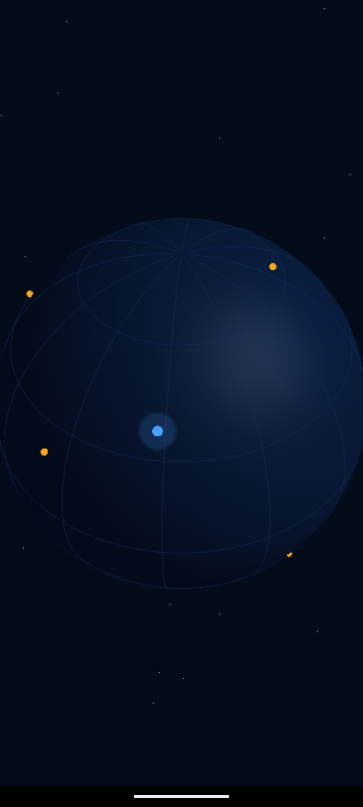
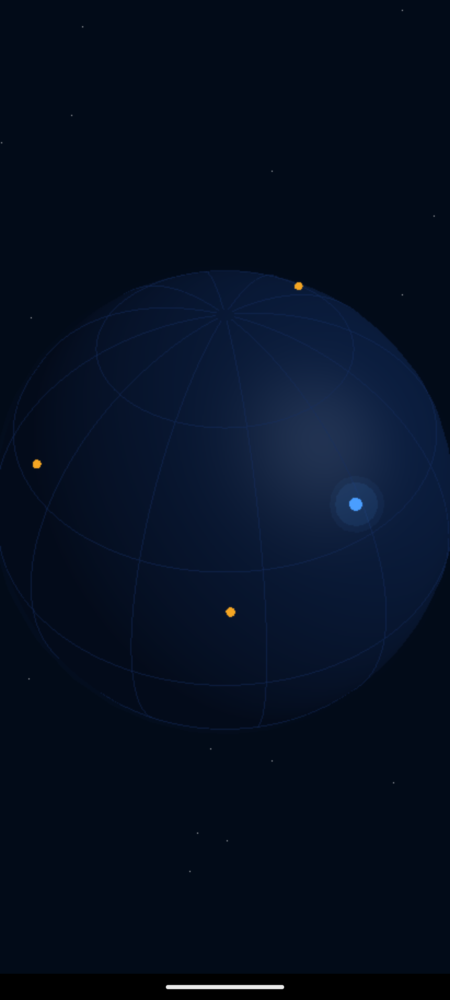

# core-globe

A standalone Kotlin Multiplatform library that renders an interactive 3D globe inside a WebView using Three.js. Exposes a single `GlobeView` composable that any Android app can drop in.

## Screenshots

<p align="center">
  
  &nbsp;&nbsp;&nbsp;
  
</p>

## Features

- Auto-rotating dark navy globe with lat/lon grid and star field
- **Current location** marker — pulsing blue beacon with animated rings
- **Destination** markers — amber dots
- **Arc** support — animated great-circle flight paths between coordinates
- Drag to rotate (touch + mouse), with rotation state fed back to Kotlin via bridge
- Tap a marker to get a callback
- Fully configurable colors, rotation speed, camera distance, atmosphere, grid, stars
- Self-contained — Three.js r128 bundled in library assets, no CDN required

## Usage

```kotlin
GlobeView(
    markers = listOf(
        GlobeMarker(id = "sfo", lat = 37.77, lng = -122.41, style = MarkerStyle.Current),
        GlobeMarker(id = "tyo", lat = 35.68, lng =  139.69, style = MarkerStyle.Destination),
        GlobeMarker(id = "hnl", lat = 21.30, lng = -157.85, style = MarkerStyle.Destination),
    ),
    arcs = listOf(
        GlobeArc(
            from = Coordinates(37.77, -122.41),
            to   = Coordinates(35.68,  139.69),
        )
    ),
    onMarkerTapped = { marker -> Log.d("Globe", "tapped: ${marker.id}") },
    modifier = Modifier.fillMaxSize()
)
```

## Configuration

```kotlin
GlobeView(
    config = GlobeConfig(
        globeColor           = "#0C1E3C",
        gridColor            = "#142D62",
        atmosphereColor      = "#1A4088",
        currentDotColor      = "#4A9EFF",
        destinationDotColor  = "#F5A623",
        arcColor             = "#4A9EFF",
        backgroundColor      = "#020B18",
        showGrid             = true,
        showAtmosphere       = true,
        showStars            = true,
        autoRotate           = true,
        autoRotateSpeed      = 0.0022f,
        cameraDistance       = 5.0f,
    )
)
```

## Setup

Add the module to your project:

```kotlin
// settings.gradle.kts
include(":core-globe")
```

```kotlin
// app/build.gradle.kts
dependencies {
    implementation(project(":core-globe"))
}
```

Add internet permission if loading anything remotely, and hardware acceleration on the Activity (required for WebView WebGL):

```xml
<activity
    android:name=".MainActivity"
    android:hardwareAccelerated="true" />
```

## Stack

| Layer | Detail |
|---|---|
| Language | Kotlin 2.1.0 · KMP |
| Android | minSdk 24 · targetSdk 35 |
| Renderer | Three.js r128 (bundled in assets) |
| Bridge | `@JavascriptInterface` + `evaluateJavascript` |
| UI | Jetpack Compose · `AndroidView` |

## V2 Roadmap

- `flyTo(Coordinates)` — animated camera rotation to a target
- iOS actual (`WKWebView`) — `expect/actual` skeleton already in place
- Arc `animationProgress` — animated draw-on effect
- Cluster markers at high zoom-out
