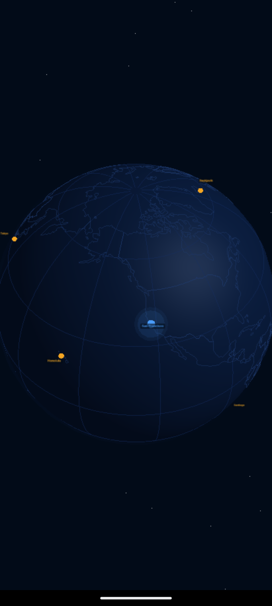
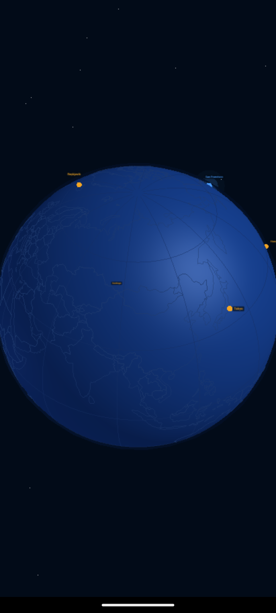
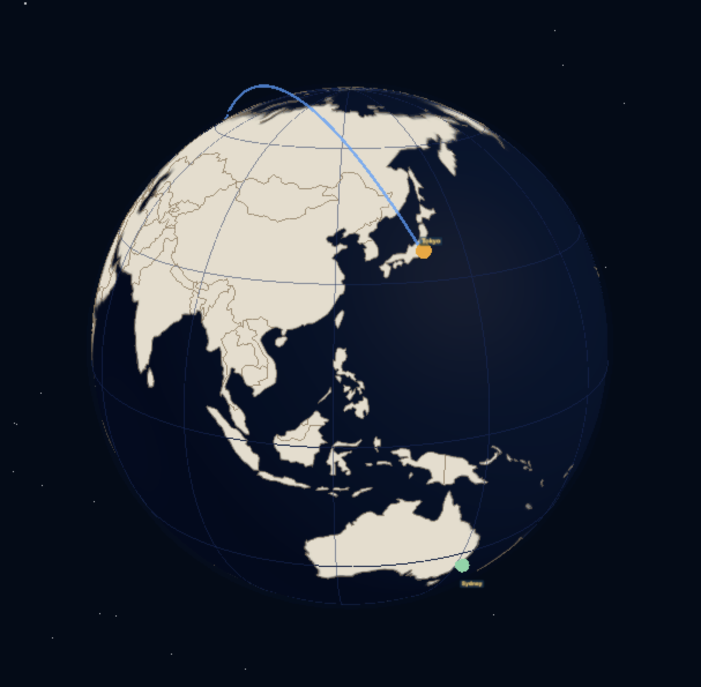

# core-globe

[](https://central.sonatype.com/artifact/io.github.advait8/core-globe)
[](https://www.npmjs.com/package/core-globe?activeTab=readme)
[](https://opensource.org/licenses/MIT)
[](https://androidweekly.net/issues/issue-737)

A standalone Kotlin Multiplatform library that renders an interactive 3D globe inside a WebView using Three.js. Exposes a single `GlobeView` composable that any Android app can drop in.

The same renderer is also published for the web as [`core-globe` on npm](https://www.npmjs.com/package/core-globe) — see `npm/README.md`.

## Screenshots

<p align="center">
  
  &nbsp;&nbsp;&nbsp;
  
</p>

**Web (npm package):**

<p align="center">
  
</p>

## Features

- Auto-rotating dark navy globe with lat/lon grid and star field
- **Land fill** — continental landmasses painted from Natural Earth land GeoJSON as a sphere texture (no raised-mesh z-fighting, no lake holes)
- **Country borders** — 177-country outlines from Natural Earth 110m data
- **Marker styles** — `Current` (pulsing blue beacon with animated rings), `Destination` (amber dot), `Custom` (per-marker color/size/pulse), `Default`, `Visited`
- **City labels** — canvas-texture sprites that always face the camera
- **Arc styles** — `Flight` (draws itself in over ~1.5s), `Dashed` (potential destinations), `Trail` (dim, fully drawn — past legs), `Custom` (color/width)
- **`flyTo(Coordinates)`** — animated camera rotation to a target
- **`animateFlight(target, from?)`** — cinematic camera flyover: the camera itself sweeps above the globe's surface along the source→destination great-circle path and descends to a low hover over the destination, firing `onFlightComplete` on arrival
- Drag to rotate (touch + mouse), with rotation state fed back to Kotlin via bridge
- Pinch-to-zoom (touch) and mouse-wheel zoom
- Tap a marker to get a callback
- Fully configurable colors, rotation speed, camera distance, atmosphere, grid, stars, land, borders
- Self-contained — Three.js r128 and land/country GeoJSON bundled in library assets, no CDN required

**Known gaps:**
- `MarkerStyle.Visited` is accepted by the API but the WebView renderer doesn't yet give it a distinct look — it currently renders identically to `Default`.
- `GlobeConfig.tiltRadians` is defined but not wired up in the renderer — the globe's tilt is hardcoded to 45° regardless of this value.

## Usage

```kotlin
GlobeView(
    markers = listOf(
        GlobeMarker(id = "sfo", lat = 37.77, lng = -122.41, style = MarkerStyle.Current),
        GlobeMarker(id = "tyo", lat = 35.68, lng =  139.69, style = MarkerStyle.Destination),
        GlobeMarker(id = "hnl", lat = 21.30, lng = -157.85, style = MarkerStyle.Destination),
    ),
    arcs = listOf(
        GlobeArc(
            from = Coordinates(37.77, -122.41),
            to   = Coordinates(35.68,  139.69),
        )
    ),
    onMarkerTapped = { marker -> Log.d("Globe", "tapped: ${marker.id}") },
    onArcAnimationComplete = { arcId -> Log.d("Globe", "arc done: $arcId") },
    modifier = Modifier.fillMaxSize()
)
```

### Camera flights

```kotlin
// Rotate the globe under a fixed camera toward a target city
GlobeView(flyTo = Coordinates(35.68, 139.69), /* ... */)

// Cinematic flyover: the camera itself travels the great-circle path and
// descends to a low hover above the destination, then fires onFlightComplete
// (e.g. to fade in a landing photo).
GlobeView(
    animateFlightTo = Coordinates(35.68, 139.69),
    animateFlightFrom = Coordinates(37.77, -122.41), // omit to start from the current camera view
    onFlightComplete = { /* landing overlay */ },
    /* ... */
)
```

## Configuration

```kotlin
GlobeView(
    config = GlobeConfig(
        globeColor           = "#0C1E3C",
        gridColor            = "#142D62",
        atmosphereColor      = "#1A4088",
        currentDotColor      = "#4A9EFF",
        destinationDotColor  = "#F5A623",
        arcColor             = "#4A9EFF",
        backgroundColor      = "#020B18",
        showGrid             = true,
        showAtmosphere       = true,
        showStars            = true,
        showLand             = true,
        landColor            = "#C8B99A",
        showBorders          = true,
        borderColor          = "#8B7355",
        autoRotate           = true,
        autoRotateSpeed      = 0.0022f,
        cameraDistance       = 5.0f,
        // tiltRadians is defined but currently has no effect — see Known gaps above.
    )
)
```

## Setup

### Maven Central (recommended)

Add the dependency to your app module:

```kotlin
// app/build.gradle.kts
dependencies {
    implementation("io.github.advait8:core-globe:0.2.6")
}
```

Make sure `mavenCentral()` is in your repository list (it is by default in new projects):

```kotlin
// settings.gradle.kts
dependencyResolutionManagement {
    repositories {
        mavenCentral()
        google()
    }
}
```

### Local module

```kotlin
// settings.gradle.kts
include(":core-globe")
```

```kotlin
// app/build.gradle.kts
dependencies {
    implementation(project(":core-globe"))
}
```

Add internet permission if loading anything remotely, and hardware acceleration on the Activity (required for WebView WebGL):

```xml
<activity
    android:name=".MainActivity"
    android:hardwareAccelerated="true" />
```

## Stack

| Layer | Detail |
|---|---|
| Language | Kotlin 2.1.0 · KMP |
| Android | minSdk 24 · compileSdk/targetSdk 35 |
| Renderer | Three.js r128 (bundled in assets) |
| Bridge | `@JavascriptInterface` + `evaluateJavascript` |
| UI | Jetpack Compose · `AndroidView` |

## Roadmap

- iOS actual (`WKWebView`) — not started; only `commonMain`/`androidMain` source sets exist today
- Give `MarkerStyle.Visited` a distinct look in the renderer (currently falls back to `Default`)
- Wire up `GlobeConfig.tiltRadians` (currently a no-op)
- Cluster markers at high zoom-out
- `onCountryClick` for the npm package — border lines aren't tagged with ISO2 or hit-testable yet (Android has the same gap)
